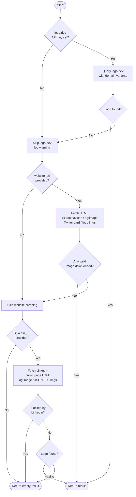

# logo-scraper

Fetch and download company logos from multiple sources — logo.dev API, company websites, and LinkedIn — with automatic priority-based fallback.


---

## Features

- **logo.dev** — high-quality logos via REST API (fastest, most reliable)
- **Website scraping** — extracts favicons, Open Graph images, Twitter cards, and `` tags from the company's own site
- **LinkedIn** — last-resort fallback using public company page HTML (og:image, JSON-LD, img tags)

All three sources use the same `Logo` / `ScrapeResult` data model, making results consistent regardless of where the logo came from.

---

## Installation

```bash
git clone https://github.com/your-username/logo-scraper.git
cd logo-scraper
pip install -e .
```

For development dependencies (pytest, ruff):

```bash
pip install -e ".[dev]"
```

**Set up your logo.dev API key:**

```bash
cp .env.example .env
# Edit .env and add your key:
# LOGODEV_API_KEY=your_key_here
```

Get a free API key at [logo.dev](https://www.logo.dev).

---

## Usage

### Single company

```bash
# Minimal — only name (logo.dev will try company.com)
logo-scraper --name "Stripe"

# With website URL (improves logo.dev domain resolution + enables website scraping)
logo-scraper --name "Nubank" --url "https://nubank.com.br"

# With all three sources available
logo-scraper --name "Spotify" \
             --url "https://spotify.com" \
             --linkedin "https://www.linkedin.com/company/spotify"

# Custom output directory
logo-scraper --name "Vercel" --url "https://vercel.com" --output "./logos/vercel"

# Pass API key directly (overrides .env)
logo-scraper --name "Stripe" --logodev-api-key "pk_YOUR_KEY"
```

### Batch mode

```bash
# Process multiple companies from a JSON file
logo-scraper --from-file examples/companies.json --output "./output"
```

The JSON file must be a list of objects with a `name` field. `url` and `linkedin` are optional:

```json
[
  { "name": "Nubank",  "url": "https://nubank.com.br",  "linkedin": "https://www.linkedin.com/company/nubank" },
  { "name": "Stripe",  "url": "https://stripe.com" },
  { "name": "iFood",                                    "linkedin": "https://www.linkedin.com/company/ifood-" }
]
```

Batch output is organized per company (`./output/nubank/`, `./output/stripe/`, …) and ends with a summary table:

```
+------------------+-------+----------+
| Company          | Logos | Sources  |
+------------------+-------+----------+
| Nubank           | 1     | logodev  |
| Stripe           | 1     | logodev  |
| iFood            | 1     | linkedin |
+------------------+-------+----------+

3/3 companies with logos found  |  3 logo(s) total
```

### Exit codes

| Code | Meaning                        |
|------|--------------------------------|
| `0`  | All logos found                |
| `1`  | One or more companies missing  |
| `2`  | Input error (bad file/JSON)    |

---

## Usage as a library

```python
from logo_scraper.orchestrator import fetch_logos

result = fetch_logos(
    company_name="Stripe",
    website_url="https://stripe.com",
    linkedin_url="https://www.linkedin.com/company/stripe",
    output_dir="./output/stripe",
    logodev_api_key="pk_YOUR_KEY",   # optional, falls back to LOGODEV_API_KEY env var
)

if result.success:
    logo = result.best_logo()
    print(f"Source: {logo.source.value}")   # "logodev" | "website" | "linkedin"
    print(f"Path:   {logo.local_path}")     # Path to downloaded file
    print(f"Format: {logo.format}")         # "PNG" | "SVG" | "JPEG"
else:
    print("No logos found:", result.errors)
```

You can also call individual scrapers directly:

```python
from pathlib import Path
from logo_scraper.scraper.logodev import scrape_logodev
from logo_scraper.scraper.website import scrape_website_logos
from logo_scraper.scraper.linkedin import scrape_linkedin_logo

logos = scrape_logodev("stripe.com", output_dir=Path("./out"))
logos = scrape_website_logos("https://stripe.com", output_dir=Path("./out"))
logos = scrape_linkedin_logo("https://www.linkedin.com/company/stripe", output_dir=Path("./out"))
```

---

## Architecture

```
logo-scraper/
├── logo_scraper/
│   ├── __init__.py
│   ├── __main__.py          # Enables `python -m logo_scraper`
│   ├── cli.py               # argparse CLI, single and batch modes
│   ├── orchestrator.py      # Priority-based source coordination
│   ├── models.py            # Logo and ScrapeResult dataclasses
│   ├── utils.py             # URL parsing, image validation, file naming
│   └── scraper/
│       ├── logodev.py       # logo.dev REST API integration
│       ├── website.py       # HTML scraping (BeautifulSoup)
│       └── linkedin.py      # LinkedIn public page scraping
├── tests/
│   ├── test_logodev.py
│   ├── test_website.py
│   ├── test_linkedin.py
│   └── test_cli.py
├── examples/
│   └── companies.json       # Sample batch input file
├── pyproject.toml
└── .env.example
```

**Key design decisions:**

- `orchestrator.py` is the only place that knows about source priority — individual scrapers are unaware of each other.
- Each scraper returns `list[Logo]` with the same shape, so the orchestrator can treat them uniformly.
- The CLI is a thin wrapper over `fetch_logos()` — library users get the same behavior without touching the CLI.

---

## How it works



The orchestrator stops at the **first source that returns at least one valid, downloaded image**. This means logo.dev is always tried first (fastest, highest quality) and LinkedIn is only reached as a last resort.

---

## Known limitations

- **LinkedIn blocks scraping aggressively.** Expect HTTP 403, status 999, or redirects to the login/authwall page. Success rate varies and can drop to near zero without warning. For production use, the [LinkedIn Marketing API](https://learn.microsoft.com/en-us/linkedin/marketing/) is the only reliable option (requires application and approval).
- **logo.dev requires a paid API key** for high-volume use. The free tier has rate limits.
- **Website scraping is heuristic.** It looks for `<link rel="icon">`, `og:image`, `twitter:image`, and `` tags with `logo` in the `src` or `alt`. Pages that load images via JavaScript will not be scraped correctly (no headless browser is used).
- **No deduplication across sources.** If the same image URL appears in multiple tags on the same page, it may be downloaded with different filenames.

---

## Running tests

```bash
pytest
```

To also run linting:

```bash
ruff check .
```

---

## Contributing

1. Fork the repository and create a feature branch.
2. Make your changes — keep commits focused and descriptive.
3. Run `pytest` and `ruff check .` before opening a PR.
4. Open a pull request with a clear description of what changed and why.

If you're adding a new logo source, implement a `fetch_logos(company, ...)` method returning `list[Logo]` and register it in `orchestrator.py` following the existing pattern.

---

## License

MIT — see [LICENSE](LICENSE) for details.
